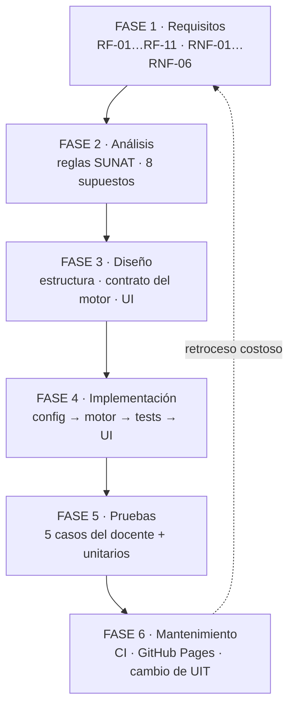

# Calculadora de Retención de Renta de Quinta Categoría — SUNAT 2026

Aplicación web que calcula, mes a mes, la **retención del impuesto a la renta de quinta
categoría** que un empleador debe efectuar en el Perú durante el ejercicio gravable **2026**,
siguiendo el procedimiento de 5 pasos publicado por SUNAT.

**Laboratorio N° 01 — Ciclo de vida en cascada** · Curso *Diseño de Software*
Autor: **Fabio Malpartida** — <fabio.malpartida@utec.edu.pe>

🔗 **Sitio publicado:** https://fabio2152.github.io/sunat-quinta-categoria/

[](https://github.com/fabio2152/sunat-quinta-categoria/actions/workflows/ci.yml)

---

## ¿Qué hace?

Se ingresa la remuneración mensual bruta y el mes de ingreso al trabajo, opcionalmente los
ingresos adicionales (gratificaciones extraordinarias, bonificaciones, utilidades, reintegros,
horas extras) y las rentas ya percibidas con un empleador anterior. La aplicación devuelve:

- **Cinco tarjetas resumen**: Remuneración Bruta Anual proyectada, Renta Neta Anual, Impuesto
  Anual Proyectado, total retenido en el año y neto anual a recibir.
- **Tabla mensual** (enero–diciembre) con ingreso ordinario, gratificación, ingreso adicional,
  ingreso bruto del mes, retención del mes y **neto a recibir**. Los meses no laborados aparecen
  atenuados.
- **Detalle didáctico**: al hacer clic (o pulsar Enter) en cualquier mes laborado se despliegan
  los **5 PASOS SUNAT** con los números concretos de ese mes.
- **Carga de los 5 casos de prueba** del laboratorio desde un desplegable.

La interfaz es responsive, accesible por teclado y funciona sin backend: es un sitio estático.

## Los 5 PASOS SUNAT

| Paso | Qué calcula | Fórmula |
|---|---|---|
| **1** | Remuneración Bruta Anual proyectada (RBA) | remuneraciones del ejercicio + gratificaciones + adicionales de meses **anteriores** + rentas del empleador anterior |
| **2** | Renta Neta Anual (RNA) | `max(0, RBA − 7 UIT)` |
| **3** | Impuesto Anual Proyectado (IAP) | escala progresiva acumulativa (8 / 14 / 17 / 20 / 30%) |
| **4** | Retención ordinaria del mes | `(IAP − retenciones ya efectuadas) / divisor del mes` |
| **5** | Retención adicional del mes | `max(0, IAP' − IAP)` recalculando con el ingreso adicional del propio mes |

**Total del mes** = retención ordinaria + retención adicional.
El ingreso adicional del propio mes **nunca** entra en el PASO 1: solo en el PASO 5.

### Escala del impuesto (UIT 2026 = S/ 5,500)

| Tramo | Rango en UIT | Rango 2026 (S/) | Tasa |
|---|---|---|---|
| 1 | Hasta 5 UIT | 0 – 27,500 | 8% |
| 2 | Más de 5 hasta 20 UIT | 27,500 – 110,000 | 14% |
| 3 | Más de 20 hasta 35 UIT | 110,000 – 192,500 | 17% |
| 4 | Más de 35 hasta 45 UIT | 192,500 – 247,500 | 20% |
| 5 | Más de 45 UIT | 247,500 a más | 30% |

### Divisores del PASO 4

| Mes | Se le deducen las retenciones de | Divisor |
|---|---|---|
| Enero, Febrero, Marzo | — | 12 |
| Abril | Enero a Marzo | 9 |
| Mayo, Junio, Julio | Enero a Abril | 8 |
| Agosto | Enero a Julio | 5 |
| Setiembre, Octubre, Noviembre | Enero a Agosto | 4 |
| Diciembre | Enero a Noviembre | 1 (regularización) |

En diciembre se admite un resultado negativo: es el **saldo a favor del trabajador**.

## Ciclo de vida en cascada



Cada fase está documentada en [`docs/`](docs/), incluyendo **qué limitación de la cascada se
evidenció** en ella:

| Documento | Contenido |
|---|---|
| [`01-requisitos.md`](docs/01-requisitos.md) | Requisitos funcionales, no funcionales y fuera de alcance |
| [`02-analisis.md`](docs/02-analisis.md) | Reglas de negocio SUNAT y los 8 supuestos asumidos |
| [`03-diseno.md`](docs/03-diseno.md) | Estructura, contrato del motor, diseño de UI y decisión de redondeo |
| [`04-implementacion.md`](docs/04-implementacion.md) | Orden de construcción y detalles de implementación |
| [`05-pruebas.md`](docs/05-pruebas.md) | Matriz de casos y evidencia de ejecución |
| [`06-mantenimiento.md`](docs/06-mantenimiento.md) | Cambio de UIT, costo de un requisito nuevo, deuda técnica |
| [`conclusiones.md`](docs/conclusiones.md) | Conclusiones del laboratorio |

## Arquitectura

```
sunat-quinta-categoria/
├── index.html                  Estructura semántica de la página
├── assets/css/styles.css       Estilos (responsive, sin librerías)
├── src/
│   ├── config.js               UIT, tramos, meses, divisores, banderas
│   ├── calculadora.js          MOTOR PURO — sin DOM, exporta calcularEjercicio()
│   ├── formato.js              formatearSoles(), formatearPorcentaje()
│   ├── casos.js                los 5 casos de prueba del laboratorio
│   └── ui.js                   formulario, render de tablas, eventos
├── test/calculadora.test.js    37 pruebas con el runner nativo de Node
├── docs/                       documentación de las 6 fases
└── .github/workflows/ci.yml    CI: node --test en cada push
```

**Decisión central:** el motor de cálculo (`src/calculadora.js`) es JavaScript puro **sin acceso
al DOM** y sin efectos secundarios. Eso permite ejecutarlo con Node sin ningún DOM simulado, y
garantiza que no exista lógica tributaria duplicada en la capa de presentación.

**Cero dependencias de runtime.** Vanilla JS (ES Modules) + HTML + CSS, sin build step:
GitHub Pages sirve `index.html` directamente.

## Ejecutar en local

Los módulos ES no se cargan desde `file://` por la política CORS del navegador, así que hay que
servir la carpeta por HTTP:

```bash
python3 -m http.server 8000
```

Y abrir <http://localhost:8000>. Alternativa sin Python:

```bash
npx serve .
```

## Ejecutar las pruebas

Requiere Node 18 o superior. No hay que instalar nada.

```bash
npm test
```

```
ℹ tests 37
ℹ pass 37
ℹ fail 0
```

## Casos de prueba

| # | Escenario | Entrada | Total retenido esperado |
|---|---|---|---|
| 1 | Remuneración baja, no supera 7 UIT | S/ 1,000 desde enero | **S/ 0.00** |
| 2 | Retención pareja todo el año | S/ 5,000 desde enero | **S/ 2,760.00** (S/ 230.00 al mes) |
| 3 | Ingreso adicional en junio (PASO 5) | S/ 5,000 desde enero + S/ 10,000 en junio | **S/ 4,160.00** |
| 4 | Ingresa en setiembre | S/ 5,000 desde setiembre | **S/ 0.00** |
| 5 | Ingresa en julio, adicional en noviembre | S/ 5,000 desde julio + S/ 10,000 en noviembre | **S/ 520.00** |

El desglose mes a mes de cada caso está en [`docs/05-pruebas.md`](docs/05-pruebas.md) y se puede
cargar en la aplicación desde el desplegable **Cargar caso de prueba**.

## Fuera de alcance

- **Deducción adicional de hasta 3 UIT**: la aplica el trabajador en su declaración anual, no el
  empleador en la retención mensual.
- Rentas de cuarta categoría y renta de fuente extranjera.
- Descuentos de AFP/ONP/EsSalud: la base de quinta categoría es la remuneración **bruta**.
- Persistencia de datos, autenticación, multi-trabajador.

La **bonificación extraordinaria del 9%** (Ley 30334) está implementada detrás de la bandera
`INCLUIR_BONIFICACION_EXTRAORDINARIA` en `src/config.js`, desactivada por defecto.

## Cambiar de ejercicio gravable

Todo lo normativo está parametrizado en [`src/config.js`](src/config.js) (RNF-03). Para pasar a
2027 basta actualizar `EJERCICIO`, `UIT` y, si la norma cambia, el arreglo `TRAMOS`. El motor no
se toca. El análisis completo está en [`docs/06-mantenimiento.md`](docs/06-mantenimiento.md).

## Fuente normativa

- **Procedimiento de cálculo (SUNAT):** <https://orientacion.sunat.gob.pe/3071-02-calculo-del-impuesto>
- **UIT 2026 = S/ 5,500.00:** Decreto Supremo N° 301-2025-EF.
- Gratificaciones y bonificación extraordinaria: Ley N° 30334.

> Herramienta didáctica para el laboratorio del curso. No constituye asesoría tributaria.

## Licencia

[MIT](LICENSE) © 2026 Fabio Malpartida
