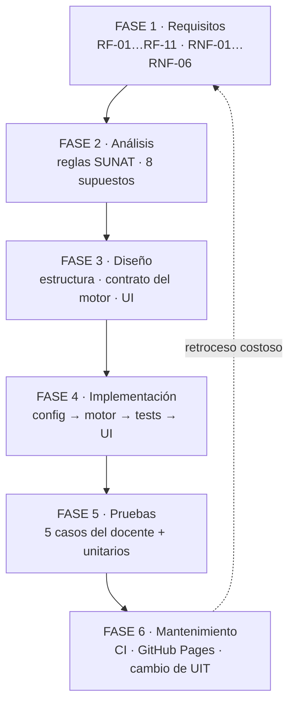

# FASE 3 — Diseño

**Entregable de la fase:** la estructura del repositorio, el contrato del motor de cálculo y el
diseño de la interfaz, todo decidido antes de implementar.

## 3.0 El ciclo de vida en cascada



La flecha punteada es el punto clave del laboratorio: en cascada, volver a requisitos desde
mantenimiento significa reabrir y rehacer todas las fases intermedias.

## 3.1 Estructura del repositorio

```
sunat-quinta-categoria/
├── index.html
├── README.md
├── LICENSE                     (MIT)
├── package.json                ("type": "module", script "test")
├── .gitignore
├── assets/
│   └── css/styles.css
├── src/
│   ├── config.js               UIT, tramos, meses, banderas
│   ├── calculadora.js          MOTOR PURO (sin DOM) — exporta calcularEjercicio()
│   ├── formato.js              formatearSoles(), formatearPorcentaje()
│   ├── casos.js                los 5 casos de prueba del docente
│   └── ui.js                   lectura del formulario, render de tablas, eventos
├── test/
│   └── calculadora.test.js     node --test
├── docs/                       01…06 + conclusiones
└── .github/workflows/ci.yml
```

### Decisión de arquitectura: separación motor / presentación

| Capa | Archivo | Puede tocar el DOM | Testeable con Node |
|---|---|---|---|
| Configuración | `config.js` | No | Sí |
| Dominio | `calculadora.js` | **No** | **Sí** |
| Formato | `formato.js` | No | Sí |
| Datos de prueba | `casos.js` | No | Sí |
| Presentación | `ui.js` | Sí | No (no se testea) |

El motor es un módulo de funciones puras: mismos argumentos → mismo resultado, sin efectos
secundarios y sin mutar la entrada (hay un test que lo verifica). Eso permite ejecutarlo con
`node --test` sin ningún DOM simulado, que era la razón para exigir "cero acceso al DOM".

## 3.2 Contrato del motor (`src/calculadora.js`)

```js
/**
 * @typedef {Object} Entrada
 * @property {number} remuneracionMensual
 * @property {number} mesIngreso                 // 1..12
 * @property {{mes:number, monto:number, concepto?:string}[]} adicionales
 * @property {number} [remuneracionesPrevias]    // otro empleador, mismo ejercicio
 * @property {number} [retencionesPrevias]       // otro empleador, mismo ejercicio
 * @property {number} [uit]                      // default config.UIT
 */

/** @returns {{filas: FilaMes[], totales: {...}, uit: number}} */
export function calcularEjercicio(entrada) { ... }
```

Cada `FilaMes` expone **todos los intermedios de los 5 PASOS** (`remuneracionBrutaAnual`,
`rentaNetaAnual`, `impuestoAnualProyectado`, `retencionesAcumuladas`, `divisor`,
`retencionOrdinaria`, `retencionAdicional`, `retencionTotal`, `neto`), más un objeto `paso5`
con `RBA'`, `RNA'` e `IAP'` cuando el mes tuvo un ingreso adicional. Esa decisión de diseño es
la que hace posible el detalle didáctico de RF-09 sin recalcular nada en la UI, y también la que
permite escribir asserts sobre pasos intermedios en los tests.

### Funciones auxiliares exportadas (todas puras, todas testeadas)

| Función | Responsabilidad |
|---|---|
| `calcularImpuestoAnual(rentaNeta, uit)` | PASO 3: escala progresiva por tramos marginales. |
| `divisorDelMes(mes)` | PASO 4: divisor 12/9/8/5/4/1 según el mes. |
| `mesesDeducidos(mes)` | PASO 4: hasta qué mes se acumulan retenciones previas. |
| `gratificacionDelMes(mes, remuneracion, mesIngreso)` | Gratificación proporcional de julio y diciembre. |
| `validarEntrada(entrada)` | RNF-05: rechaza entradas inválidas con mensajes en español. |
| `redondear2(x)` | Redondeo a 2 decimales en un único lugar. |

## 3.3 Diseño de la interfaz

- **Encabezado**: título, ejercicio, UIT vigente, deducción fija y enlace a la fuente SUNAT.
- **Panel de entrada** (izquierda; arriba en móvil): remuneración mensual, mes de ingreso
  (`<select>`), sección colapsable *Empleador anterior*, lista dinámica de ingresos adicionales,
  botones **Calcular** y **Limpiar**, y un `<select>` de casos de prueba que rellena el formulario.
- **Panel de resultados**: cinco tarjetas resumen (RBA proyectada, Renta Neta, Impuesto Anual
  Proyectado, Total retenido, Neto anual) y la tabla mensual de RF-08 con fila de totales. Los
  meses no laborados se muestran atenuados con "— no laborado —".
- **Detalle didáctico**: al hacer clic (o pulsar Enter) en una fila laborada se despliegan los
  5 PASOS con los números concretos de ese mes.
- Estética sobria, tipografía del sistema, cero librerías externas.

## 3.4 Decisión de redondeo (§2.4)

Se calcula con `Number` a precisión completa y se redondea con `Math.round(x * 100) / 100`
**solo al acumular una retención y al mostrar** un monto. Razones:

1. **Fidelidad a la norma.** La retención efectivamente retenida en un mes es un monto en soles
   con 2 decimales, y es *ese* monto el que se deduce en los meses siguientes (PASO 4). Si se
   arrastrara la precisión completa, las deducciones no coincidirían con lo realmente retenido.
2. **Evitar acumulación de error.** Redondear en cada operación intermedia (por ejemplo, dentro
   del cálculo por tramos) introduciría un sesgo que se amplifica al proyectar 12 meses.
3. **Casos como el 4** dependen de esto: la gratificación de Navidad de 4/6 vale
   `5000 × 4/6 = 3333.333…`; se conserva en pleno para la proyección y se muestra como
   `S/ 3,333.33`. La tolerancia de comparación en los tests es ±0.01 precisamente por esto.

## 3.5 Restricciones técnicas asumidas en el diseño

- Rutas **relativas** (`./src/…`, `./assets/…`): GitHub Pages sirve el sitio bajo un
  subdirectorio, y las rutas absolutas se romperían.
- `<script type="module">`: obliga a servir por HTTP (no `file://`) por la política CORS de los
  módulos ES. Documentado en el README.
- Cero dependencias de runtime, cero `localStorage`, cero llamadas de red.

## Limitación de la cascada evidenciada en esta fase

El diseño se cerró **antes** de tener un solo número calculado. Dos consecuencias concretas:

1. El contrato de `FilaMes` tuvo que anticipar exactamente qué intermedios necesitaría RF-09.
   Se acertó porque la spec listaba los 5 pasos, pero fue una anticipación, no una verificación.
2. La decisión de redondeo se justificó en el papel y solo se **comprobó** en la FASE 5, con el
   caso 4. Si hubiera estado mal, el error habría llegado a pruebas con el motor ya escrito y
   todos los tests basados en él.

En un ciclo iterativo, el diseño del contrato y la regla de redondeo se habrían validado con un
espigón (*spike*) de una tarde sobre el caso 3, antes de comprometer la estructura completa.
